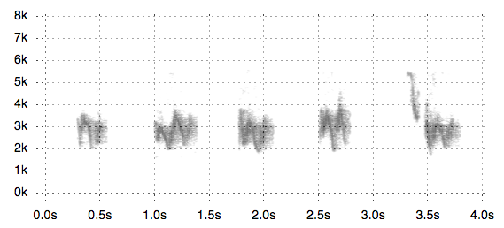

# SpectrogramJS

Visualize sounds as a spectrogram - right in your browser!

## Usage

Include the css for .spectrogram elements

    <link href="css/spectrogram.css" media="screen" rel="stylesheet" type="text/css" />

SpectrogramJS depends on D3.js - so make sure you include them first..

    

Then source spectrogram.js

    

To create a new spectrogram, create a new instance of Spectrogram and pass in the audio file to analyze, the selector id where to display the visual, and any options you would like to set.

For example, if I had a div with an id of "vis" in my html:

    

I would add a spectrogram there by using:

    var sample = new Spectrogram('data/bird_short.ogg', "#vis", {
        width: 600,
        height: 300,
        colorScheme: ['#440154', '#472877', '#3e4a89', '#31688d', '#26838e', '#1f9e89', '#36b778', '#6dcd59', '#b4dd2c', '#fde725']
        });

## Options

Currently, the defaults of a Spectrogram are changed by passing in an object of options. This might change to a more chainable API.

But for now, there are a few things you can change:

    width: width in pixels of the spectrogram.

    height: height in pixels of the spectrogram.

    sampleSize: Number of samples to analyze frequencies of. Suggested: 512, or 256. A smaller number means more sampling, which means better resolution but a slower visual display.

    maxFrequency: The maximum frequency to display initially.

    minFrequency: The minimum frequency to display.

    colorScheme : Array of a color scheme
